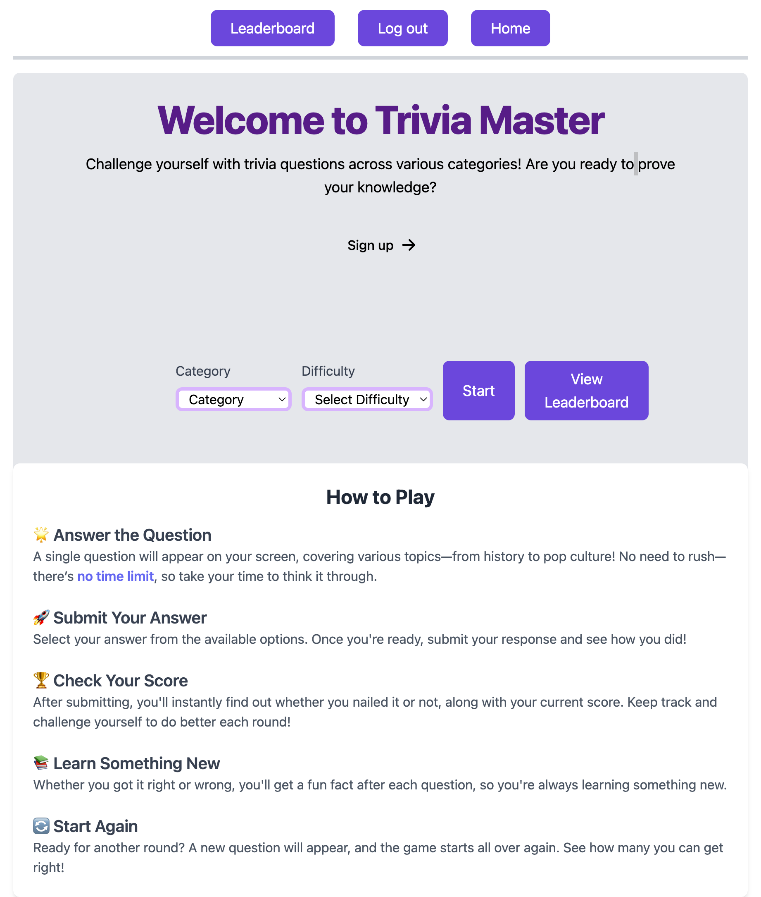
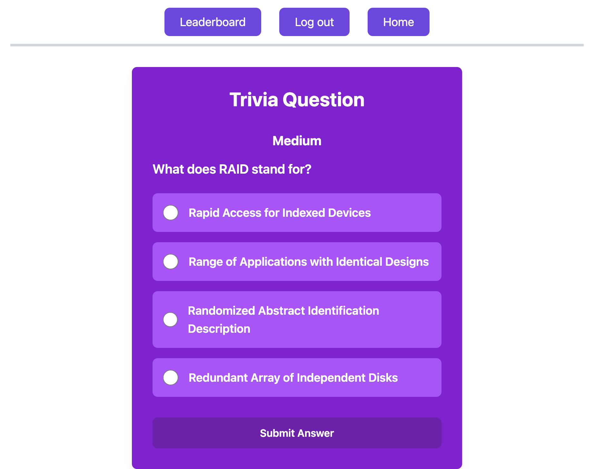

# Trivia Master

## Overview

**Trivia Master** is a web application where you can put your trivia knowledge to the test! When you start the game, choose a category and difficulty level that suits you. Afterwards, you will be presented with the question and the answers will be arranged in a multiple-choice list. After submitting your answer, you'll immediately know if you chose the correct answer or not and your score will be updated accordingly. Be sure to visit the Leaderboard to see how your score compares to other players! If you want to keep challenging yourself, you can choose to play as many rounds as you'd like. See if you can make it to the top of the leaderboard!

Challenge yourself to our trivia game at: [Trivia Master](https://triviagame-1c98.onrender.com)

## Features

- **Categories**: Players have a wide selection of categores, from Music to Geography!
- **Difficulty Levels**: Whether you want to play casually or really challenge yourself, choose the difficutly level that suits you!
- **Leaderboard**: Compare your score to other players! Do you have what it takes to make it to the top of the leaderboard?

## Screenshots

## Technology Used

[Open Trivia Database API](https://opentdb.com/)

[Node.js](https://nodejs.org/en)

[Express](https://expressjs.com/)

[Sequelize](https://sequelize.org/)

[Handlebars](https://handlebarsjs.com/)

[Tailwind CSS](https://tailwindcss.com/)

## Resources

[Sequelize Model Querying - Basics](https://sequelize.org/docs/v6/core-concepts/model-querying-basics/#simple-update-queries)

[MDN - decodeURI](https://developer.mozilla.org/en-US/docs/Web/JavaScript/Reference/Global_Objects/decodeURI)

[MDN - Fetch API](https://developer.mozilla.org/en-US/docs/Web/API/Fetch_API)
